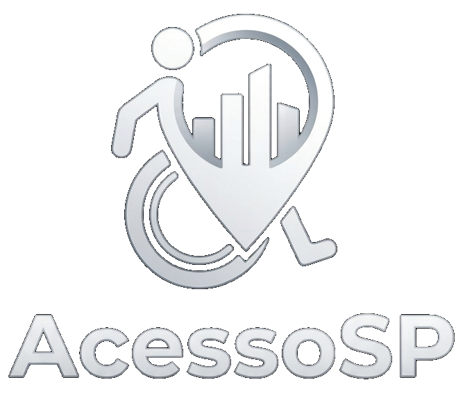

(Este é um projeto acadêmico)

   
  <strong>Construindo uma São Paulo mais inclusiva, transparente e acessível para todos.</strong>

  
  
  

---

## 📝 Sobre o Projeto

O **AcessoSP** é uma plataforma digital colaborativa desenvolvida com o propósito de mapear, avaliar e promover a **acessibilidade urbana** na cidade de São Paulo. A iniciativa funciona como um guia comunitário onde cidadãos podem partilhar experiências reais sobre as condições de acesso a estabelecimentos comerciais, espaços públicos e pontos turísticos, ajudando pessoas com deficiência (PCD) ou mobilidade reduzida a navegar pela cidade com maior autonomia, segurança e dignidade.

Verifique o site em: https://mttsdev.github.io/Acesso-SP

Com uma interface moderna, totalmente responsiva (*Mobile-First*) e focada em boas práticas de inclusão, o projeto une a conscientização social à tecnologia para transformar a infraestrutura urbana através da força da comunidade.

---

## 🎯 Funcionalidades Principais

* **Mapeamento Colaborativo de Locais:** Consulta de estabelecimentos e espaços públicos avaliados por utilizadores reais em São Paulo.
* **Sistema de Avaliação Rápida (Feedback Visual):** Identificação imediata se um local cumpre os requisitos de acessibilidade através de indicadores visuais de "Gostei" (`thumb_up`) e "Não Gostei" (`thumb_down`).
* **Central de Consciencialização (FAQ/Accordion):** Secção educativa interativa dedicada a explicar os diferentes tipos de acessibilidade (arquitetónica, atitudinal, comunicacional, etc.) e como pequenos gestos do dia a dia geram grandes mudanças.
* **Rede de Profissionais:** Espaço dedicado para conectar a comunidade a especialistas em acessibilidade, engenharia adaptativa e suporte inclusivo.
* **Interface Totalmente Responsiva:** Navegação fluida e otimizada desde ecrãs de smartphones (com menu lateral em formato de gaveta) até monitores desktop de alta resolução.

---

## 🛠️ Tecnologias Utilizadas

O ecossistema do frontend foi construído utilizando tecnologias web nativas, priorizando a performance, semântica limpa e modularidade do código:

* **HTML5:** Estruturação semântica e acessível de todos os componentes da plataforma.
* **CSS3 Avançado:** * Arquitetura baseada em **Variáveis Globais (`:root`)** para gestão centralizada do *Design System*.
  * Metodologia de nomenclatura **BEM (Block, Element, Modifier)** para estilos previsíveis e reutilizáveis.
  * Layout dinâmico com **Flexbox** e **Media Queries** adaptativas.
* **JavaScript (Vanilla JS):** Lógica nativa e leve para manipulação do DOM, controlo de estados de componentes (como abertura/fecho do menu móvel e expansão de itens de acessibilidade).
* **Google Material Symbols & FontAwesome:** Ícones vetoriais modernos para suporte e feedback visual intuitivo.

---

## 🎨 Design System & Identidade Visual

A paleta de cores e tipografia do **AcessoSP** foram planeadas para transmitir confiança, clareza e frescura visual, alinhando-se com a temática de suporte urbano humano:

* **Cores de Destaque:** * `Hex #0D7A7B` (Verde Principal da Navbar — Estabilidade e Acessibilidade)
  * `Hex #159A9C` (Verde Secundário — Ações e Destaques)
  * `Hex #DFF2E9` (Tom Claro Inclusivo — Contrastes e Textos Suaves)
  * `Hex #1A65D6` (Azul de Ação Externa)
* **Tipografia:** Sistema de fontes nativas modernas e altamente legíveis (`-apple-system`, `BlinkMacSystemFont`, `Segoe UI`, `Roboto`), complementado pela fonte premium **Poppins** para layouts institucionais e formulários.
